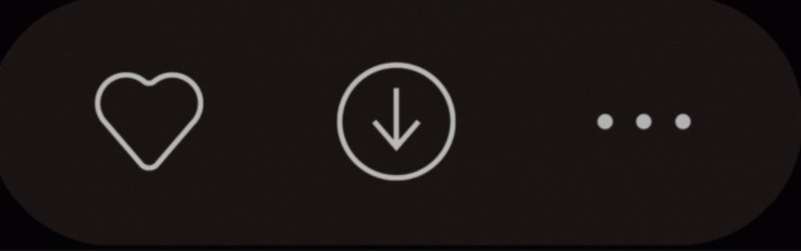
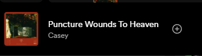

# First Journal Entry 

# Title: Spotify navigating music recommendations 
 By Ahmad Iraki 3/26 

 Like many people, I use Spotify to browse, play, and find new music however recently they have changed an integral feature of the system by which you like and save music previous to this change the way it would work is you could either click a save to playlist button or click a heart-shaped button to favorite a song this is a pretty common **convention** layout wise you can find a similar favorite feature in many apps for media, while also having the button in a shape of a heart gives it a lot of **Affordance** as we naturally assume that adding a heart next to or around something means its the users favorite 

However recently they have changed this with in my opinion a worse design the new one has just one button a circle with a plus in the middle now both the favorite function and the add to playlist are one in the same in my experiance seeing it the first time I clicked on it expecting to add it to favorite but instead it added to a my most recently added to playlist this didnt match my **my mental model** at all and had a complete mismatch with the actual **conceptual model** of the design now after you click it a pop up shows telling you which playlist it was added to along with a button saying "change" clicking on this I found here you had the choice to change and pick which playlists you want to add it to which includes your favorite playlist which previously had the mentioned dedicated button. as for what could be changed to improve what I find to be a poorly designed ui I would simply revert to the previous verson as while this design consolidates the two which is a positive either reverting it or possibly changing it so that it immideitly goes into the playlist editing mode instead of auto adding it to your most recent. 

